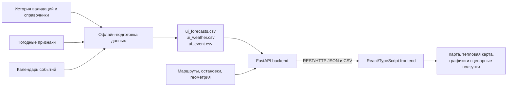

# Поток — прогноз пассажиропотока трамвайных маршрутов

Контейнеризированный веб-сервис для анализа загрузки трамвайных веток и
сценарного прогноза пассажиропотока. В состав решения входят FastAPI backend,
React/TypeScript frontend, карта маршрутов, тепловая карта, прогноз по часам,
события, погодная и сезонная поправки, а также экспорт дневного прогноза в CSV.

## Запуск

Требования: Docker Desktop с Docker Compose.

```bash
git clone https://github.com/mekuun/tram-demand-forecasting-app.git
cd tram-demand-forecasting-app
docker compose up --build
```

Точки входа после запуска:

- веб-сервис: <http://localhost:3000>;
- API: <http://localhost:8000>;
- Swagger/OpenAPI: <http://localhost:8000/docs>;
- healthcheck: <http://localhost:8000/health>.

Порты `3000` и `8000` можно изменить в `docker-compose.yml`. Все runtime-данные
подключаются в backend как read-only volume, поэтому замена CSV не требует
переписывать код.

## Архитектура

Схема модулей и границы ответственности вынесены в отдельный документ:
[docs/architecture.md](docs/architecture.md).



Runtime-разделение:

1. **Приём и нормализация.** Backend читает UTF-8 CSV с разделителем `;`,
   валидирует дату и час, приводит числовые поля к типам Python.
2. **Признаки и геопривязка.** `tram-routes.json` содержит маршруты и остановки,
   `tram-geometries.json` — линии для карты. `place_id` не используется как
   остановка: по правилам датасета это площадка/депо.
3. **ML-прогноз и агрегация.** Подготовленный offline ML-прогноз хранится в
   `frontend/ui_forecasts.csv`. Backend применяет сценарные коэффициенты,
   считает дневные итоги, пики, тепловую карту и рекомендуемый выпуск.
4. **API.** FastAPI отдаёт единый dashboard, метаданные, healthcheck и CSV.
5. **Frontend.** React запрашивает API без собственного повторного инференса и
   визуализирует результат.

### Формула сценарного прогноза

```text
forecast = base_prediction
           * season_coefficient^s
           * weather_coefficient^w
           * event_coefficient^e
```

`s`, `w`, `e` передаются в диапазоне `0..2`. При значении `1` формула
воспроизводит подготовленный итоговый прогноз с учётом всех трёх коэффициентов.
При `0` соответствующий коэффициент становится нейтральным (`x^0 = 1`).

## REST API

### `GET /health`

Проверка доступности backend и количества загруженных строк прогноза.

### `GET /api/v1/meta`

Возвращает маршруты, остановки, геометрию, доступные даты и профили планового
выпуска.

### `GET /api/v1/dashboard`

Основной запрос интерфейса:

```text
/api/v1/dashboard?date=2025-12-31&route_id=17&hour=18\
&season_strength=1&weather_strength=1&event_strength=1
```

Параметры:

| Параметр | Обязателен | Описание |
|---|---:|---|
| `date` | да | Дата прогноза `YYYY-MM-DD` |
| `route_id` | да | Номер маршрута |
| `hour` | нет | Выбранный час `0..23` |
| `season_strength` | нет | Сила сезонной поправки `0..2` |
| `weather_strength` | нет | Сила погодной поправки `0..2` |
| `event_strength` | нет | Сила событийной поправки `0..2` |

Ответ содержит почасовой прогноз выбранного маршрута, прогнозы всех веток для
тепловой карты, сводку по сети, список событий и planning profiles.

### `GET /api/v1/export/day.csv`

Экспорт 24 почасовых значений выбранного маршрута:

```text
/api/v1/export/day.csv?date=2025-12-31&route_id=17\
&season_strength=1&weather_strength=1&event_strength=1
```

Остановка/участок присутствует в сервисе как геометрия и справочник остановок
для карты. Исходный конкурсный target агрегирован на уровне `маршрут × час`,
поэтому отдельный ML-target на каждую остановку в этом решении честно не
выдумывается. Аналогично, горизонт runtime-прогноза — выбранные сутки с
24 часами; дневной CSV является явной точкой интеграции для внешнего планировщика.

## Данные и внешние источники

### Ссылки

- [Официальный архив датасета хакатона](https://disk.yandex.ru/d/DiFwlfMOauxjBg) —
  история валидаций, тестовый период и справочники организаторов.
- [Яндекс Карты JS API](https://yandex.com/dev/maps/jsapi/doc/2.1/) — карта и
  отрисовка геометрии в интерфейсе; ключ не нужен для API прогноза.
- [ВДНХ: афиша/события](https://vdnh.ru/news/4222/) и
  [транспорт до ВДНХ](https://vdnh.ru/visitors/transport/).
- [Лужники: афиша](https://www.luzhniki.ru/afisha/).
- [Мос.ру](https://www.mos.ru/) — источник общегородских событий.
- Официальные страницы площадок: [Олимпийский](https://olimpik.ru/),
  [МТС Live Холл](https://www.msk-live-hall.mts.ru/contacts),
  [Сокольники](https://mosgor-park.ru/events/sokolniki/all),
  [Дом музыки](https://www.mmdm.ru/).

Полный перечень URL конкретных событий хранится рядом с данными:
`events_2025.csv` содержит `source_url` для каждой записи, а
`venue_route_links.csv` — `source_url` площадки и обоснование связи с
маршрутом/остановкой. Это позволяет жюри проверить происхождение каждого
событийного коэффициента.

### Runtime-файлы

| Файл | Назначение |
|---|---|
| `frontend/ui_forecasts.csv` | Нейтральный `base_prediction`, сезонный коэффициент и итоговый `prediction` |
| `ui_weather.csv` | Почасовой `weather_coefficient` по маршруту и дате |
| `ui_event.csv` | Почасовой `event_coefficient` по маршруту и дате |
| `frontend/ui_events.csv` | Список событий для отображения в интерфейсе |
| `frontend/ui_planning_profiles.csv` | Профили маршрутов и расчёт рекомендуемого выпуска |
| `frontend/app/tram-routes.json` | Маршруты и остановки |
| `frontend/app/tram-geometries.json` | Геометрии веток для карты |

`ui_weather.csv` и `ui_event.csv` — воспроизводимые подготовленные признаки,
а не online-запросы. Во время запуска сервис не зависит от доступности внешнего
weather/news API: все коэффициенты уже лежат в репозитории и монтируются в
контейнер read-only. Сырые данные, код обучения и ExtraTrees-артефакт находятся
в отдельном ML-контуре; этот репозиторий отвечает за поставку прогнозов,
сценарный пересчёт и веб-сервис.

## Производительность

Замер выполнен **27.09.2026** на локальном Docker Desktop, один контейнер
backend, без кэша reverse proxy. Перед серией выполнен прогрев. Клиентский
нагрузочный скрипт использует только стандартную библиотеку Python,
`ThreadPoolExecutor`, 20 одновременных клиентов и проверяет HTTP-код/полное
чтение тела ответа.

| Endpoint | Запросов | Ошибок | RPS | p50 | p95 | p99 |
|---|---:|---:|---:|---:|---:|---:|
| `GET /health` | 300 | 0 | 1 015 | 19 мс | 26 мс | 32 мс |
| `GET /api/v1/dashboard` | 200 | 0 | **107** | **175 мс** | **267 мс** | 324 мс |
| `GET /api/v1/meta` | 200 | 0 | 20 | 958 мс | 1 181 мс | 1 419 мс |

`dashboard` — основной рабочий запрос интерфейса; он укладывается в заявленный
диапазон p95 около 300 мс на одном экземпляре и выдержал 200 запросов без
ошибок. `meta` отдаёт крупный payload со всеми остановками и геометрией и
вызывается один раз при загрузке страницы, поэтому его RPS не следует сравнивать
с горячим прогнозным endpoint. Повторяемый тест:

```bash
docker compose up --build -d
python3 scripts/benchmark.py --base-url http://localhost:8000 --concurrency 20
```

Backend не хранит пользовательское состояние, а подготовленные данные кэширует
с инвалидированием по `mtime`/размеру файлов. Поэтому API можно масштабировать
горизонтально за reverse proxy при вынесении общего read-only набора CSV в образ
или объектное/файловое хранилище.


Приложение не требует запуска отдельной базы данных: для демонстрационного
контура достаточно двух контейнеров `backend` и `frontend`.
