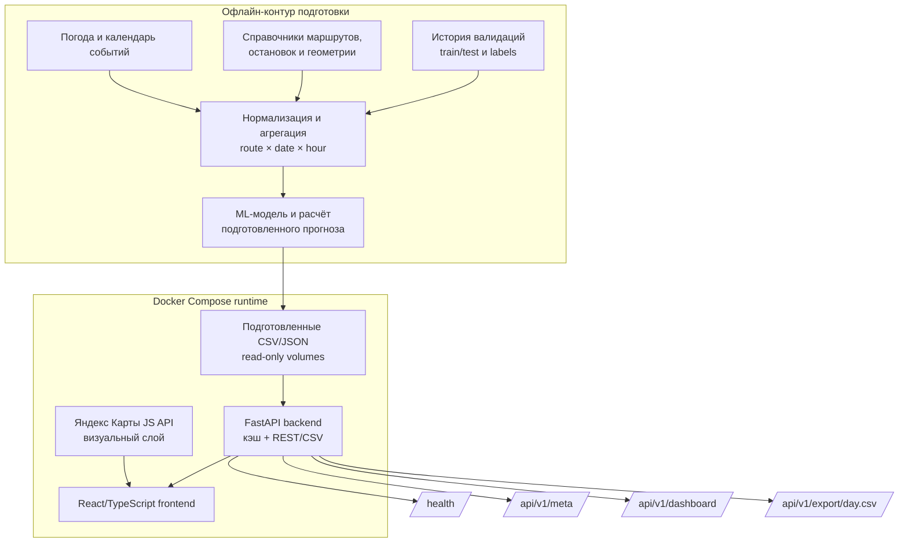

# Архитектура и границы решения

## Схема



## Границы модулей

### 1. Приём и нормализация

В текущем runtime-контуре эту роль выполняет `backend/app/main.py`:

- чтение CSV с `;` и UTF-8;
- преобразование `route`, `date`, `hour` и признаков в типизированные значения;
- проверка формата даты и диапазона часа;
- кэширование разобранных таблиц;
- автоматическая очистка кэша при изменении mounted CSV.

Обучение модели в данный репозиторий не включено: runtime получает
версионированный артефакт `ui_forecasts.csv` из ML-контура.

### 2. Признаки и геопривязка

`tram-routes.json` и `tram-geometries.json` дают справочник маршрутов, список
остановок и линии для карты. В исходном конкурсном target нет корректной
остановочной разметки посадок: `place_id` — площадка/депо, а прогнозный target
определён на уровне `route × hour`. Поэтому карта показывает географический
контекст маршрута, но не маскирует маршрутный прогноз под точность остановочного
уровня.

### 3. ML-прогноз и агрегация

`base_prediction` — нейтральная точка, подготовленная в ML-контуре. Итог в
runtime считается формулой:

```text
base_prediction
× season_coefficient^s
× weather_coefficient^w
× event_coefficient^e
```

Силы `0..2` позволяют сравнивать нейтральный сценарий, базовую модель и
усиленный сценарий. Backend дополнительно агрегирует 24 часа, вычисляет
пиковый/минимальный час, тепловую карту сети и рекомендацию по выпуску.

### 4. API и frontend

Backend stateless: на запросе выбираются дата, маршрут, час и силы поправок.
Frontend не держит копию модели и не повторяет инференс — это делает формулу
прозрачной и одинаковой для UI и CSV-экспорта.

## Масштабирование

Данные read-only и локально кэшируются в каждом backend-инстансе. Для
горизонтального масштабирования перед контейнерами добавляется reverse proxy,
а несколько одинаковых backend-контейнеров получают один и тот же набор
артефактов. Состояние пользовательских сценариев находится в браузере и не
требует sticky sessions.
